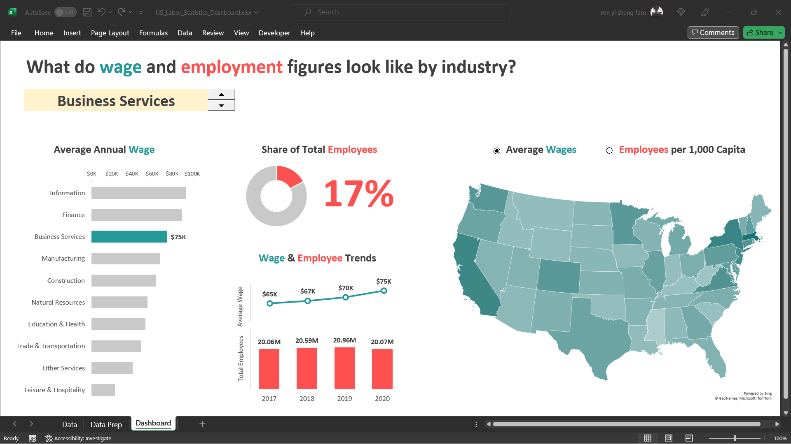
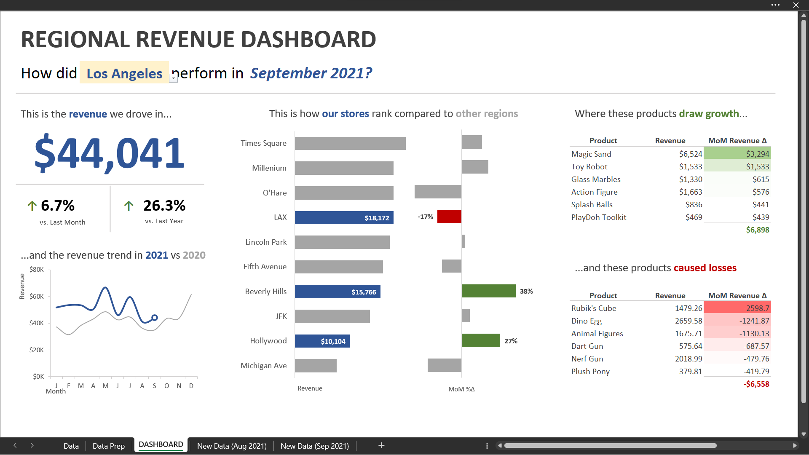

# Following are my projects in Excel:  
### *You can also take a look at my Linkedin : [RonTheAnalyst](https://www.linkedin.com/in/ronfam/)*  

- [x] **Excel** - 

*Kindly download these Excel files from this repository and view them in Microsoft Excel.*

- US Labor Statistics Data: Career Industries Interactive Dashboard  
Scenario: I am a Research Analyst at a non-profit organization helping high school seniors find career paths. My boss needs a dashboard built for an upcoming round of school visits.  

 
 
- Toy Stores Monthly Sales Data: Toy Stores Regional Revenue Dashboard  
Scenario: COO have a monthly call with the Regional Sales Managers, and ask me to build a dashboard that they can use to filter by region, track monthly revenue trends, and see performance year-over-year. He'd also like to compare performance across stores, and identify which specific products drove the biggest gains and losses  

--------------------------------------------------------------------------------------------------------------------------------------------------------------------------------
